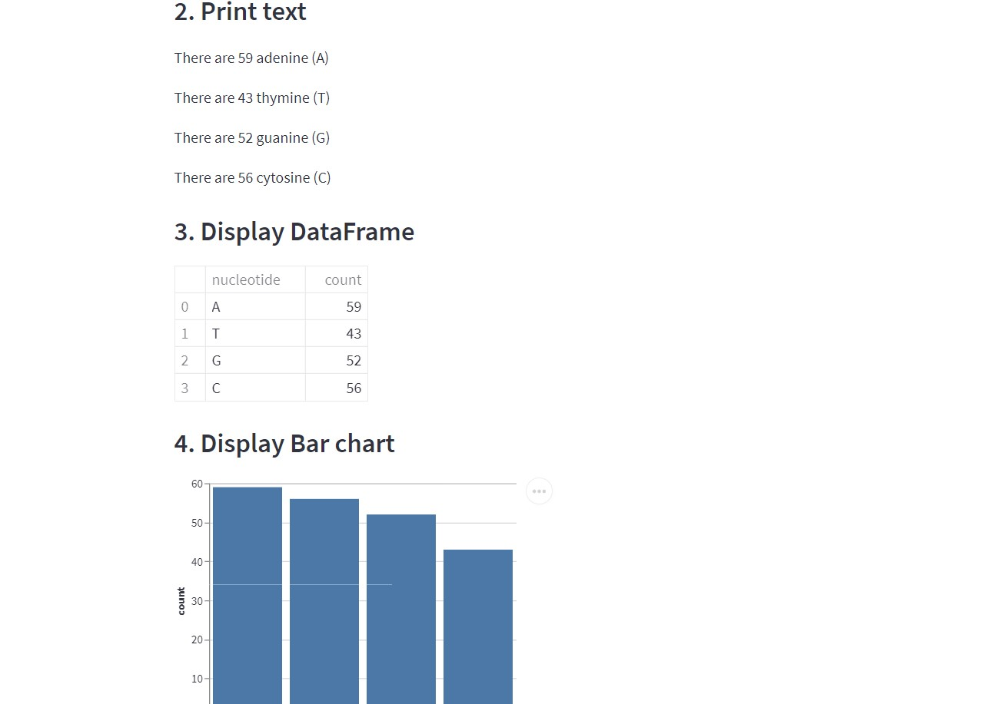

<a href="https://share.streamlit.io/techcoderr/dna-bioinfo-tool/main/bioinfo.py" target="_blank">Open in stremlit</a>

# DNA-BIOINFO-TOOL
DNA BIOINFO TOOL USINH STREAMLIT

Information about four components present in DNA SEQENCE
<ul>
  <li>adenine (A)</li>
  <li>thymine (T)</li>
<li>guanine (G)</li>
<li>cytosine (C)</li>

</ul>

PREVIEW 

